# ₿ Bitcoin Prediction Tracker (Python CLI)


---

## 📌 Project Overview

This project is a command-line **Bitcoin Prediction Tracker** built using Python.

It allows users to load historical BTC data, explore it, analyze trends, and even generate simple predictions based on past performance.

The goal of this project was to simulate how financial data can be explored and used to make quick insights and decisions.

---

## 🎬 Demo

### 🏠 Main Menu

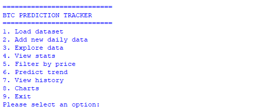

This is the main interface of the program where users can choose different operations like loading data, exploring it, viewing statistics, predicting trends, and generating charts.

---

## 🚀 Features Walkthrough

---

### 1️⃣ Load Dataset

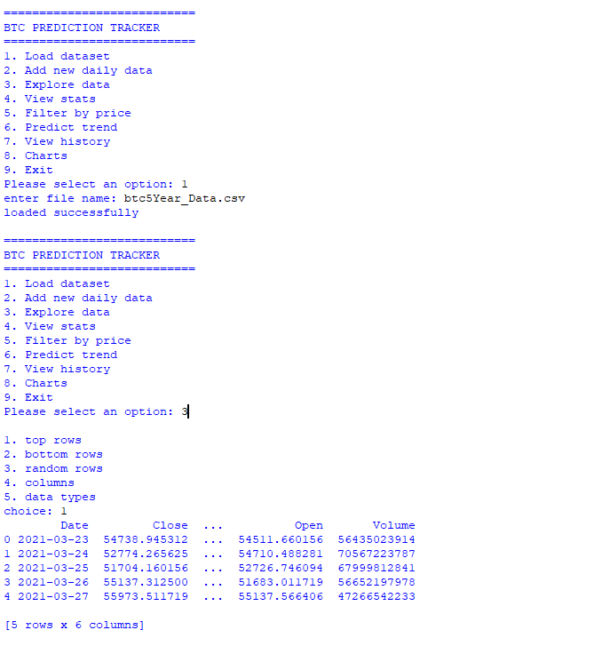

Here, the user loads a CSV file containing Bitcoin data.
Once loaded successfully, all other features become available.

---

### 2️⃣ Explore Data

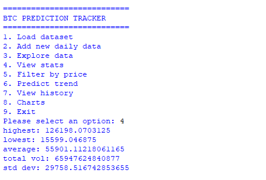

This option helps you quickly inspect the dataset by showing:

* Top rows
* Bottom rows
* Random samples
* Column names and data types

Useful for understanding the structure of the data before analysis.

---

### 3️⃣ View Statistics

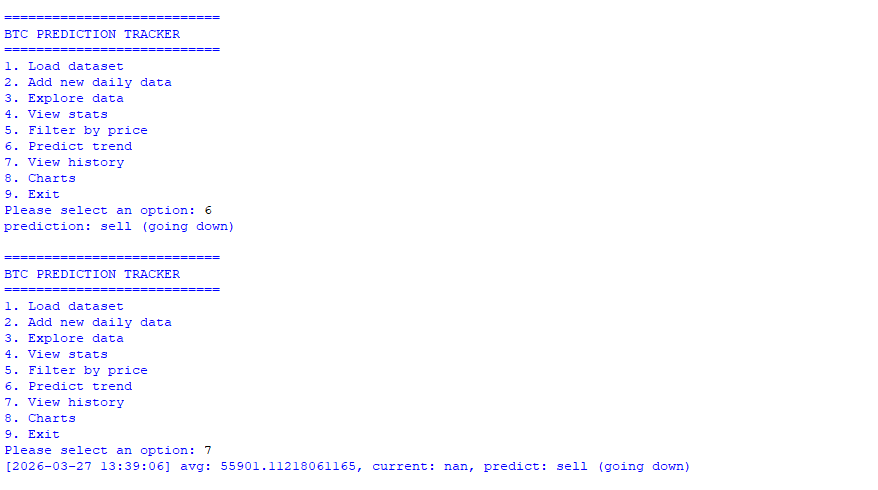

Displays key insights such as:

* Highest price
* Lowest price
* Average price
* Total volume
* Standard deviation

This gives a quick summary of the dataset.

---

### 4️⃣ Predict Trend

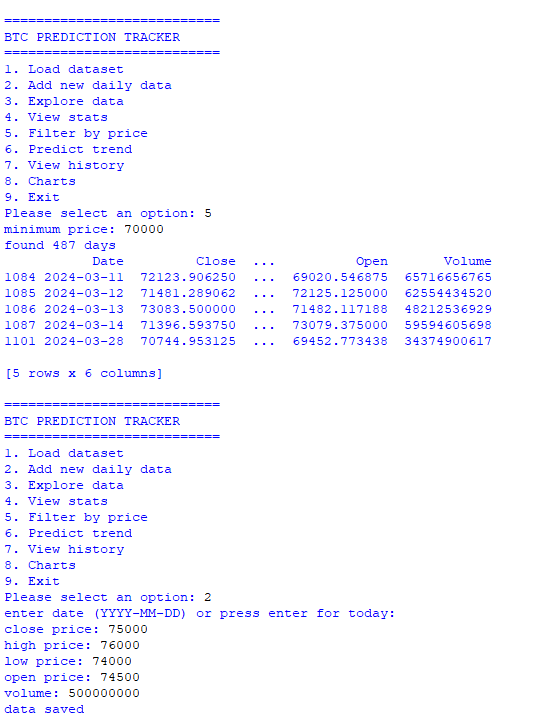

A simple trend prediction based on historical averages.
The program indicates whether the market is likely going **up or down**.

---

### 5️⃣ Filter by Price

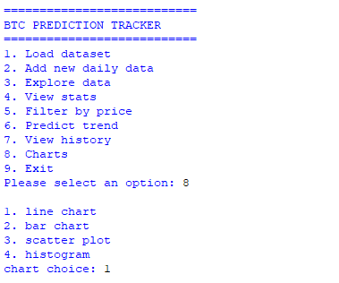

Allows users to filter Bitcoin data based on a minimum price.
This is useful for identifying high-value trading periods.

---

### 6️⃣ Add New Daily Data

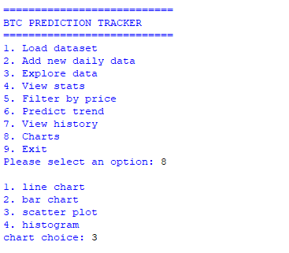

Users can manually input new daily BTC data such as:

* Closing price
* High / Low
* Volume

This keeps the dataset updated.

---

### 7️⃣ Charts Menu

The program allows generating different visualizations:

* Line Chart
* Bar Chart
* Scatter Plot
* Histogram

These help visualize trends and relationships in the data.

---

### 8️⃣ Exit Program

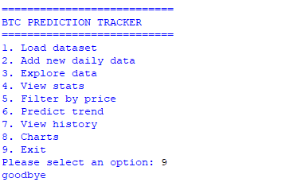

Gracefully exits the application.

---

## 📊 Charts & Visualizations

### 📈 Bitcoin Price Trend (Line Chart)

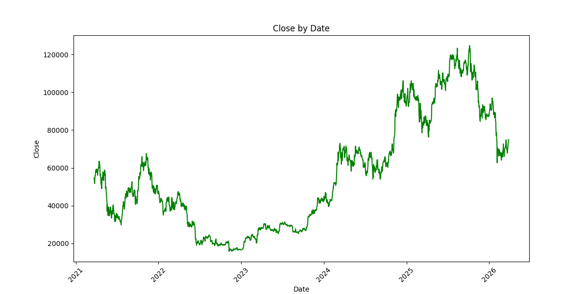

Shows how Bitcoin price changes over time.

---

### 📉 Volume vs Price (Scatter Plot)

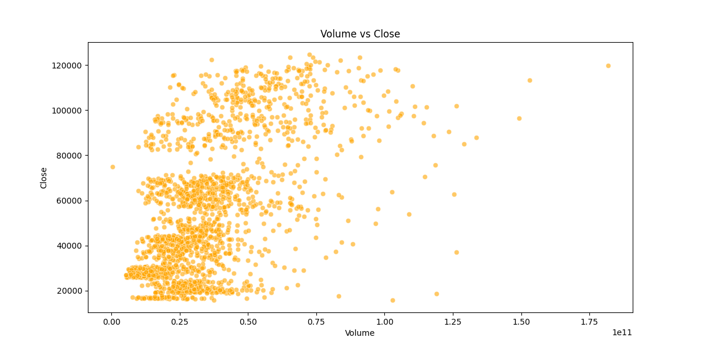

Helps visualize the relationship between trading volume and price.

---

## 🧠 Skills Demonstrated

* Data Analysis using Pandas
* Financial Data Interpretation
* Data Visualization with Matplotlib
* CLI Application Development
* Basic Trend Prediction Logic

---

## 🧭 Program Flow

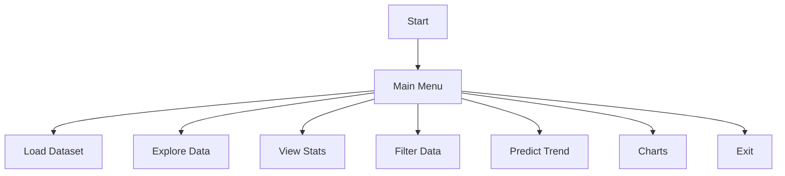

---

## 🧩 Project Structure

```
project/
│
├── BTC_script.py
├── btc5Year_Data.csv
│
├── charts/
│   ├── line_chart.png
│   ├── scatter_chart.png
│
├── screenshots/
│   ├── mainmenu.png
│   ├── sc1.png
│   ├── sc2.png
│   ├── sc3.png
│   ├── sc4.png
│   ├── sc5.png
│   ├── sc6.png
│   ├── exit.png
│
└── README.md
```

---

## ▶️ How to Run

```bash
git clone <your-repo-link>
cd project
pip install pandas matplotlib
python your_script_name.py
```

---

## 💼 Why This Project Matters

This project demonstrates how financial data can be analyzed and used to extract insights.

It highlights real-world skills such as:

* Data exploration
* Statistical analysis
* Visualization
* Basic prediction logic

These are highly relevant for roles in **Data Analysis, Finance, and Python Development**.

---

## 🔮 Future Improvements

* Add machine learning prediction models
* Integrate real-time Bitcoin API
* Build a web dashboard (Streamlit)
* Add advanced technical indicators

---

## 📜 License

This project is open source and free to use.


---

## 💬 Final Thought

“Markets change every second — the edge comes from understanding the data behind them.”
