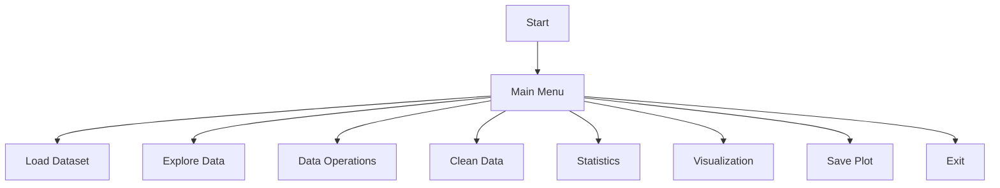

# 📊 Bitcoin Price Analysis & Visualization (Python CLI)


---

## 📌 Project Overview

This project is a command-line **Bitcoin Data Analysis & Visualization tool** built using Python.

It focuses on analyzing historical Bitcoin data and generating meaningful insights through visualizations. The goal was to simulate a real-world data analysis workflow — from loading data to exploring trends and relationships.

---

## 🎬 Demo

### 🏠 Main Menu


---

## 📊 Generated Charts

### 📈 Bitcoin Closing Price Over Time


---

### 📉 Volume vs Closing Price (Scatter Plot)


---

## 🚀 Key Features

| Feature            | What it Does                                |
| ------------------ | ------------------------------------------- |
| 📂 Load Dataset    | Load Bitcoin CSV dataset                    |
| 🔍 Explore Data    | Inspect rows, columns, and data types       |
| 🧮 Data Operations | Perform filtering, sorting, and aggregation |
| 🧹 Data Cleaning   | Handle missing values                       |
| 📊 Statistics      | Generate descriptive statistics             |
| 📈 Visualization   | Create charts like line & scatter plots     |
| 💾 Save Charts     | Save generated plots                        |

---

## 🧠 Skills Demonstrated

* Data Analysis using Pandas
* Data Visualization using Matplotlib & Seaborn
* Exploratory Data Analysis (EDA)
* Data Cleaning Techniques
* CLI Application Design

---

## 🧭 Program Flow



---

## 🧩 Project Structure

```
project/
│
├── Python_Visualizer.py
├── enhanced_dashboard_data.csv
│
├── charts/
│   ├── line_chart.png
│   ├── scatter_chart.png
│
├── screenshots/
│   ├── mainmenu.png
│   ├── opt1.png
│   ├── opt2.png
│   ├── opt3.png
│   ├── opt4.png
│   ├── opt5.png
│   ├── opt6.png
│   ├── opt6-7.png
│   ├── opt7.png
│   ├── opt8.png
│
└── README.md
```

---

## 🖥️ Application Walkthrough

### 1️⃣ Load Dataset


---

### 2️⃣ Explore Data


---

### 3️⃣ DataFrame Operations


---

### 4️⃣ Handle Missing Data


---

### 5️⃣ Generate Statistics


---

### 6️⃣ Data Visualization


---

### 7️⃣ Save Visualization


---

### 8️⃣ Exit


---

## ▶️ How to Run

```bash
git clone <your-repo-link>
cd project
pip install pandas matplotlib seaborn
python Python_Visualizer.py
```

---

## 💼 Why This Project Matters

This project demonstrates a full data analysis pipeline:

* Loading real-world datasets
* Cleaning and transforming data
* Performing analysis
* Visualizing insights

These are core skills used in **Data Analyst and Data Science roles**.

---

## 🔮 Future Improvements

* Add real-time Bitcoin API data
* Build a Streamlit dashboard
* Add predictive modeling
* Improve UI/UX

---

## 📜 License

This project is open source and free to use.

---

## 👤 Author

Developed by Dash

---

## 💬 Final Thought

“Data is not just numbers — it’s a story waiting to be told.”
